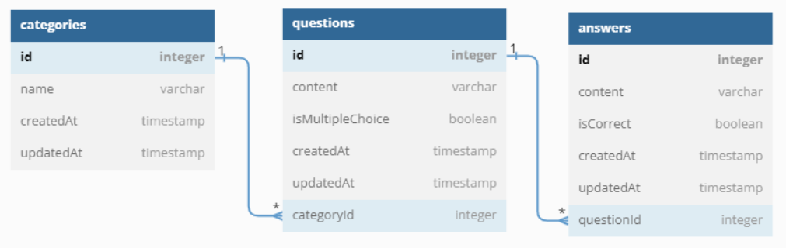

# Dokumentacja aplikacji QuizyEasy

---

### 1. Identyfikacja zagadnienia biznesowego

Celem projektu jest stworzenie aplikacji, która umożliwi każdej osobie tworzenie pytań testowych oraz rozwiązywanie
wygenerowanych quizów. Aplikacja zakłada możliwość dodawania pytań zarówno jednokrotnego, jak i wielokrotnego wyboru z
nieograniczoną ilością możliwych odpowiedzi. Użytkownik powinien być w stanie w prosty i intuicyjny sposób stworzyć
kategorię, wyświetlić listę istniejących kategorii, dodać nowe pytania, wyświetlić pytanie w danej kategorii wraz z
poprawnymi odpowiedziami oraz wziąć udział w quizie. Zdefiniowany powyżej zakres projektu jest w pełni zrealizowany
przez zaproponowaną aplikację. W przypadku rozszerzenia potrzeb biznesowych, aplikacja może być w łatwy sposób
modyfikowana i rozszerzana. Przykładowym rozszerzeniem może być dodanie systemu autoryzacji, możliwości modyfikacji
istniejących pytać, prywatnych kategorii i pytań, a także zbieranie statystyk z rozwiązanych testów.

### 2. Wymagania systemowe i funkcjonalne

Projekt oparty jest o architekturę MVC i składa się z dwóch części: serwerowej oraz klienckiej. Wykorzystano
renderowanie po stronie klienta, a komunikacja między serwerem a klientem odbywa się z wykorzystaniem asynchroniczej
komunikacji z użyciem REST API. Część serwerowa została napisana z użyciem środowiska uruchomieniowego Node.js, i
frameworka Express. Jako bazę danych wykorzystano relacyjną bazę MySQL, a komunikacja z nią odbywa się przy użyciu
Sequelize, który pełni rolę ORMa. Część kliencką napisano z wykorzystaniem biblioteki React, a do stylizacji widoków
użyto biblioteki Tailwind.

Funkcjonalości aplikacji:

- wyświetlanie informacji o przeznaczeniu systemu
- tworzenie kategorii
    - tworzenie nowych kategorii dla quizów
    - kategoria powinna mieć unikalną nazwę
- wyświetlanie listy kategorii
- dodawanie pytań
    - tworzenie nowych pytań w ramach wybranej kategorii
    - tworzenie pytań jednokrotnego i wielokrotnego wyboru
    - dodawanie nielimitowanej liczby możliwych odpowiedzi
- wyświetlanie pytań w wybranej kategorii wraz z poprawnymi odpowiedziami
- rozwiązywanie quizów składających się z pytań z wybranej kategorii

### 3. Analiza zagadnienia i jego modelowanie

Diagram związków encji



Zapytania na konkretne endpointy są przesyłane przez routing który wybiera odpowiednią metodę kontrolara do obsługi
danego żądania. Następnie kontroler komunikuje się z serwisem który przeprowadza logikę biznesową. Może on wykorzystać
warstwę dostępu do danych aby pobrać dane z bazy. Wyniki zwracane są do kontrolera który odsyła odpowiedź na żądanie.

Endpointy:

- GET /categories - zwraca wszystkie kategorie
- GET /categories/quizzes - zwraca kategorie posiadające pytania
- GET /categories/:categoryId - zwraca pojedynczą kategorię
- POST /categories - tworzy kategorię
- GET /categories/:categoryId/questions - zwraca pytania z odpowiedziami dla danej kategorii
- GET /categories/:categoryId/questions/quiz - zwraca identyfikatory wylosowanych pytań
- POST /categories/:categoryId/questions - tworzy pytanie w danej kategorii
- GET /questions/:questionId - zwraca pytanie wraz z dostępnymi odpowiedziami
- GET /questions/:questionId/correctAnswers - zwraca identyfikatory poprawnych odpowiedzi pytania

### 4. Implementacja

Po stronie serwera wykorzystano Node.js, Express, Sequelize, oraz MySQL jako jako relacyjną bazę. W pliku `./app.js`
zdefiniowano podstawowe routingi, przenoszące obsługe przychodzących zapytań do routingów
umieszczonych w folderze `./api/v1/routes`. Do zdefiniowania bazy danych użyto Sequalize jako przykład ORM. W
foldere `./models` zdefiniowano trzy podstawowe modele: `categories`, `questions` i `answers`. Przykład modelu pytania:

```js
module.exports = (sequelize, Sequelize) => {
    return sequelize.define("question", {
            content: {
                type: Sequelize.STRING,
                allowNull: false
            },
            isMultipleChoice: {
                type: Sequelize.BOOLEAN,
                allowNull: false
            }
        },
        {
            tableName: 'questions'
        });
};
```

W tym samym folderze znajduje się konfiguracja bazy. Najciekawszym fragmentem jest zdefiniowanie relacji między
modelami:

```js
db.category.hasMany(db.question);
db.question.belongsTo(db.category);
db.question.hasMany(db.answer, {as: 'answers'});
db.answer.belongsTo(db.question);
```

Routingi delegują zapytania do kontrolerów zdefiniowanych w folderze `./api/v1/controllers`, które to następnie
korzystająć z serwisów ubsługują żądania. W serwisach występuje walidacja przysyłanych danych i w razie niespełniania
wymogów zwracany jest niestandardowy wyjątek:

```js
class ServiceError extends Error {
    constructor(message, code) {
        super(message);
        this.code = code
    }
}

module.exports = ServiceError
```

Przykład obsługi niepoprawnych danych z `categoryService`

```js
const createCategory = async (category) => {
    if (!category.name) {
        throw new ServiceError('Brak nazwy kategorii.', 400);
    }
    // dalsze operacje
    return await daoCategory.createCategory(category);
};
```

Kontroler jest w stanie przechwycić błęd i zwrócic odpowiednią odpowiedź do klienta:

```js
const createCategory = async (req, res) => {
    try {
        const category = await categoryService.createCategory(req.body);
        res.status(201).json({status: 201, data: category, message: "Pomyślnie stworzono kategorię"});
    } catch (err) {
        if (err instanceof ServiceError) {
            res.status(err.code).json({status: err.code, message: err.message});
        }
    }
}
```

Kluczowym elementem projektu są quizy. Każdy quiz za każdym razem powinien wyświetlać pytania w różnej kolejności. Aby
to osiągnąć po stronie serwera znajduje się mechanizm pozwalający bezpośrednio z bazy losować identyfikatory pytań. W
poniższym kodzie używająć ORMa dla pytań pobieramy identyfikatory pytań dla danej kategorii, ustawiamy je w losowej
kolejności a następnie bierzemy tylko określoną liczbę.

```js 
return Question
    .findAll({
        where: {
            categoryId: categoryId
        },
        attributes: ['id'],
        order: db.sequelize.random(),
        limit: limit
    })
    .then(data => {
        return data;
    })
```

Po stronie klienta wykorzystano bibliotekę React oraz Tailwind do definiowania stylów. Axios jest użyty do wykonywania
asynchronicznych zapytań do serwera. Kluczowym elementem klienta jest
zdefiniowany w pliku `./client/src/App.jsx` routing. Do jego definicji użyto biblioteki React Router która umożliwa
nawigację i zarządzanie trasowaniem.

```jsx
<Routes>
    <Route path="/" element={<Navigation/>}>
        <Route index element={<MainPage/>}/>
        <Route path="kategorie">
            <Route index element={<Categories/>}/>
            <Route path=":categoryId" element={<Category/>}/>
        </Route>
        <Route path="quizy">
            <Route index element={<Quizzes/>}/>
            <Route path=":categoryId" element={<Quiz/>}/>
        </Route>
        <Route path="*" element={<div>Nie znaleziono strony</div>}/>
    </Route>
</Routes>
```

Komponenty wykorzystują `hooki` biblioteki React do zarządzania danymi oraz komponentem. Przykłądowe
wykorzystanie `useState` w przypadku powiększania ilości możliwych odpowiedzi odczas tworzenia pytania:

```js
const [answers, setAnswers] = useState([
    {content: '', isCorrect: false},
    {content: '', isCorrect: false},
]);

const handleAddAnswer = () => {
    const answer = {content: '', isCorrect: false};
    setAnswers([...answers, answer]);
};
```

### 5. Podsumowanie

Aplikacja spełnia zdefiniowane w [rozdziale pierwszym](#1-identyfikacja-zagadnienia-biznesowego) wymagania biznesowe.
Osiągnięty cel jest w pełni niezależną i funkcjonującą aplikacją. Podczas implementacji z racji użytych technologii,
użytej architektury MVC oraz podziału kodu na odrębne funkcjonalności, nie napotkano na żadne trudności. Prostota
aplikacji i utrzymanie czystego kodu pozwala na bezprobelmowe zrozumienie kodu aplikacji, co czyni ją prostą do
rozszerzania. Ważniejsze z możliwych rozszerzeń to:

- systemu autoryzacji
- modyfikacja pytań, kategorii i odpowiedzi
- prywatyzacja kategorii i pytań
- gromadzenie statystyk
- filtrowanie kategorii, quizów i pytań
- dodawanie zdjęć dla pytań i kategorii